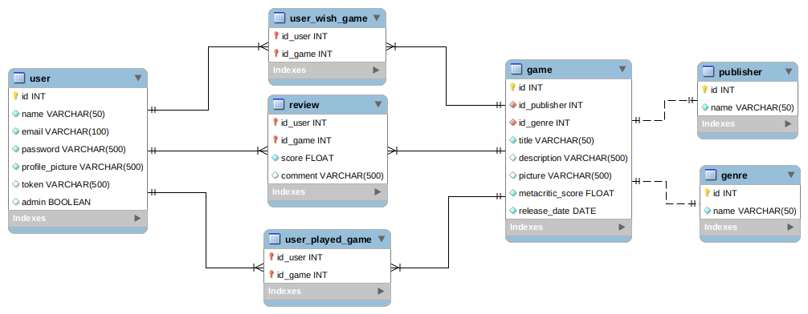
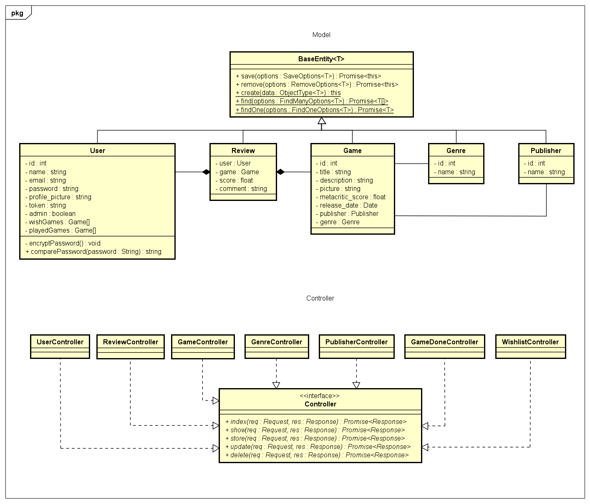

# trophys-room
Aplicação que cataloga games, desenvolvido para a disciplina Engenharia de Software

[Link da Documentação da API](https://app.swaggerhub.com/apis-docs/Augusto9/trophys-room/1.0.0)

## Modelo Relacional do Banco de Dados

## Diagrama de Classes
